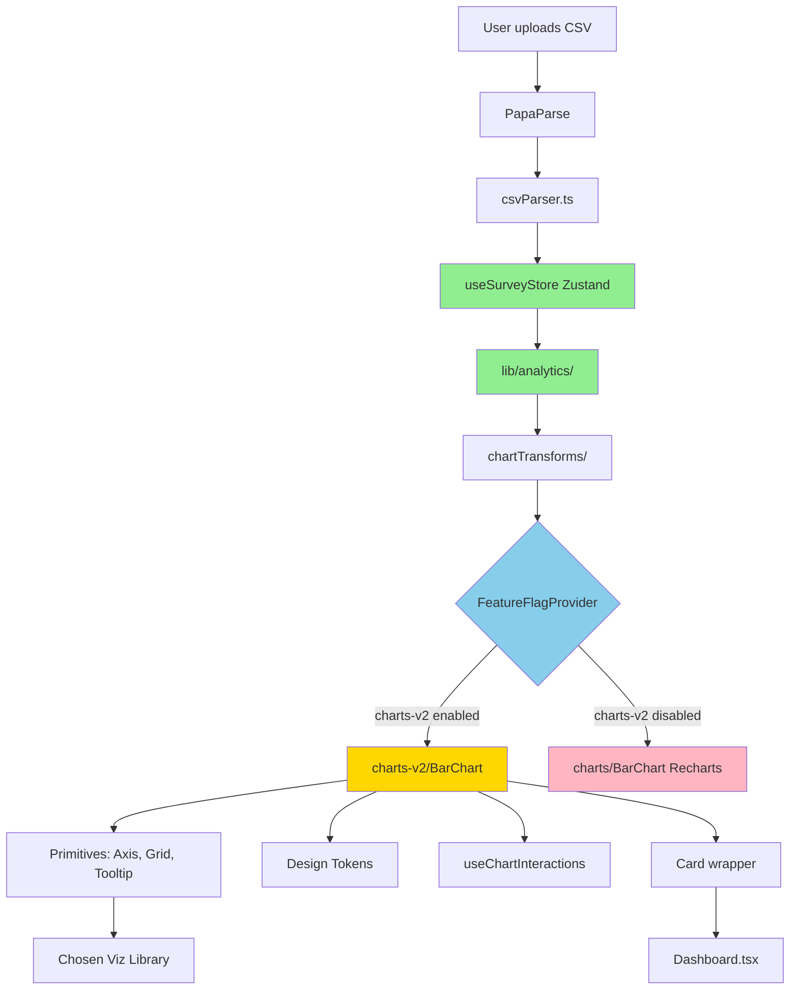

# Survey Dashboard Brownfield Enhancement Architecture

**Project:** Survey Dashboard
**Document Type:** Brownfield Enhancement Architecture
**Version:** 1.0
**Date:** 2025-11-19
**Author:** Winston (Architect)

---

## Table of Contents

1. [Introduction](#introduction)
2. [Enhancement Scope and Integration Strategy](#enhancement-scope-and-integration-strategy)
3. [Tech Stack](#tech-stack)
4. [Data Models and Schema Changes](#data-models-and-schema-changes)
5. [Component Architecture](#component-architecture)
6. [Source Tree](#source-tree)
7. [Infrastructure and Deployment Integration](#infrastructure-and-deployment-integration)
8. [Coding Standards](#coding-standards)
9. [Testing Strategy](#testing-strategy)
10. [Security Integration](#security-integration)
11. [Next Steps](#next-steps)

---

## Introduction

This document outlines the architectural approach for enhancing the Survey Dashboard with a comprehensive visualization layer enhancement. Its primary goal is to serve as the guiding architectural blueprint for AI-driven development of new features while ensuring seamless integration with the existing system.

**Relationship to Existing Architecture:**
This document supplements your existing project structure by defining how new chart components will integrate with current systems. The visualization enhancement replaces the presentation layer (Recharts components) while preserving all data processing, state management, and application logic.

### Existing Project Analysis

#### Current Project State

- **Primary Purpose:** Client-side survey analytics dashboard that accepts CSV uploads, performs comprehensive data analysis (descriptive statistics, sentiment analysis, text analytics), and visualizes results through interactive charts

- **Current Tech Stack:** React 19.1.1 + TypeScript 5.9.3, Vite 7.1.7 build system, Zustand 5.0.8 state management, React Router 7.9.5, Tailwind CSS 3.4.18, Recharts 3.3.0 charts, Framer Motion 12.23.24 animations, PapaParse 5.5.3 CSV parsing, Sentiment.js 5.0.2 text analysis

- **Architecture Style:** Single Page Application (SPA) with component-based React architecture, client-side processing only (no backend), functional programming patterns with React hooks, immutable state management via Zustand

- **Deployment Method:** Static site deployment compatible with Netlify/Vercel/GitHub Pages, client-side bundle served via CDN, no server-side processing requirements

#### Available Documentation

- ✅ README.md with feature overview and getting started guide
- ✅ package.json with complete dependency manifest
- ✅ Brownfield PRD (docs/prd.md) documenting 73-story enhancement initiative
- ✅ 73 user stories in BMad format (docs/stories/) organized by epic
- ✅ Tailwind config with custom design system (colors, typography, spacing)
- ❌ No formal architecture documentation (this document establishes it)
- ❌ No API documentation (not applicable - no backend)
- ❌ No database schema (not applicable - client-side only)

#### Identified Constraints

- **Client-Side Processing Constraint:** All data processing must occur in browser - no server-side computation available. CSV files limited to ~10MB for performance.

- **React 19.1.1 Compatibility:** Chosen visualization library must support React 19 (latest stable). Many libraries may not yet have full compatibility.

- **No Backend Integration:** Enhancement cannot introduce server-side requirements. Feature flagging and gradual rollout must use client-side mechanisms (localStorage, environment variables).

- **Bundle Size Sensitivity:** Current bundle is ~150KB gzipped. Enhancement must stay under 200KB total to maintain fast load times.

- **TypeScript Strict Mode:** Project uses TypeScript strict mode - new library must have high-quality type definitions with no `any` escapes.

- **Existing State Shape:** Zustand store structure (`SurveyData` interface) is consumed by multiple components - cannot be modified without breaking changes.

- **Tailwind Design System:** Custom Tailwind configuration defines brand colors, typography, and spacing - new charts must align with existing design tokens.

- **Vite Build System:** Enhancement must work with Vite's ES module system and HMR - cannot require Webpack-specific features.

### Change Log

| Date | Version | Description | Author |
|------|---------|-------------|--------|
| 2025-11-19 | 1.0 | Initial architecture document creation | Winston (Architect) |

---

## Enhancement Scope and Integration Strategy

### Enhancement Overview

**Enhancement Type:** Technology Stack Upgrade + Major Feature Modification

**Scope:** Comprehensive visualization layer enhancement spanning 73 stories across 12 epics:
- Evaluate and potentially migrate from Recharts 3.3.0 to Visx or Tremor
- Build formal design system (tokens, color scales, typography definitions)
- Create primitive component library (Axis, Grid, Tooltip, Legend, Container)
- Enhance all 4 existing chart types (Bar, Line, Pie, Scatter) with advanced features
- Add new chart types (Area charts, Donut charts, Sparklines)
- Implement interactive features (zoom/pan, brush selection, data export)
- Ensure WCAG 2.1 AA accessibility compliance
- Gradual production migration via feature flags
- Performance optimization and polish

**Integration Impact:** **Significant** - Replaces presentation layer while preserving data/state/routing layers

### Integration Approach

#### Code Integration Strategy

**Coexistence During Migration:**
- New visualization components will live in `src/components/charts-v2/` directory alongside existing `src/components/charts/`
- Feature flag system (React Context) will control which chart implementation renders
- Both Recharts and new library will coexist temporarily during gradual rollout (Weeks 8-9)
- After 100% rollout, `charts/` directory will be deprecated and removed

**Component Boundaries:**
```
┌─────────────────────────────────────────────────┐
│           PRESERVED (No Changes)                │
├─────────────────────────────────────────────────┤
│ • CSV Upload & Parsing (PapaParse)             │
│ • Data Type Detection (csvParser.ts)           │
│ • Analytics Engine (lib/analytics/)            │
│ • Sentiment Analysis (Sentiment.js)            │
│ • State Management (Zustand store)             │
│ • Routing (React Router)                       │
│ • UI Primitives (Button, Card, Stat, etc.)     │
└─────────────────────────────────────────────────┘

┌─────────────────────────────────────────────────┐
│           ENHANCED/REPLACED                     │
├─────────────────────────────────────────────────┤
│ • Chart Components (charts/ → charts-v2/)      │
│ • Visualization Library (Recharts → TBD)       │
│ • Chart Styling (inline → design tokens)       │
└─────────────────────────────────────────────────┘

┌─────────────────────────────────────────────────┐
│              NEW ADDITIONS                      │
├─────────────────────────────────────────────────┤
│ • Design Token System (lib/designTokens/)      │
│ • Chart Data Transforms (lib/chartTransforms/) │
│ • Feature Flag Context (contexts/)             │
│ • Chart Interaction Hooks (hooks/)             │
│ • Testing Infrastructure (Vitest, RTL)         │
│ • Storybook Documentation (dev only)           │
└─────────────────────────────────────────────────┘
```

#### Database Integration
- **Not Applicable** - No database exists. All data is ephemeral (in-memory from CSV upload).
- sessionStorage will be used for chart interaction state (zoom level, selected ranges) to persist across page navigation within session
- No persistent storage requirements

#### API Integration
- **Not Applicable** - No backend APIs exist. Pure client-side SPA.
- **Future Consideration:** CSV export feature (FR9) will use client-side file generation via Blob API and download links
- No server-side API calls required for any enhancement features

#### UI Integration

**Page-Level Integration:**
1. **Dashboard.tsx** - Replace existing `<BarChart />` and `<PieChart />` imports with charts-v2 equivalents, wrapped in feature flag conditional
2. **Insights.tsx** - Add new sentiment donut chart, word frequency bar chart; existing text analytics display unchanged
3. **Upload.tsx** - No changes

**Component-Level Integration:**
- New charts will be wrapped in existing `<Card>` component for consistent styling
- Loading states will use existing `<LoadingSpinner>` component
- Empty states will extend existing `<EmptyState>` component
- All charts will consume data from existing `useSurveyStore()` hook without state shape changes

**Design System Integration:**
- New design tokens will extend (not replace) existing Tailwind configuration
- Chart-specific color scales will be added to `tailwind.config.js` under `colors.chart` namespace
- Typography and spacing tokens will reference existing Tailwind scale
- No breaking changes to existing component styles

### Compatibility Requirements

**UI/UX Consistency:**
- ✅ **Color Palette:** New chart colors must use existing Tailwind color system (primary blue, success green, warning orange, error red) plus new data visualization scales
- ✅ **Typography:** Charts must use existing system font stack and Tailwind text sizing (text-xs through text-4xl)
- ✅ **Spacing:** Chart margins, padding, and gaps must use existing Tailwind spacing scale (p-4, p-6, gap-4, etc.)
- ✅ **Component Integration:** Charts wrapped in existing Card component, tooltips match existing tooltip styling
- ✅ **Animation Timing:** Chart animations must use existing Framer Motion timing (400ms entrance, 300ms updates) and respect prefers-reduced-motion
- ✅ **Interaction Patterns:** Hover states use blue-100 highlight, focus uses blue-500 ring, consistent with existing buttons/inputs

**Performance Impact:**
- ✅ **Bundle Size:** Total bundle must stay under 200KB gzipped (currently ~150KB, allowing +50KB for new library)
- ✅ **Render Performance:** Chart initial render <100ms, re-render <50ms, interaction <16ms (60fps)
- ✅ **Memory Usage:** No memory leaks from chart re-renders, proper cleanup of event listeners and timers
- ✅ **Code Splitting:** Charts-v2 components lazy-loaded via React.lazy() to minimize initial bundle impact

---

## Tech Stack

### Existing Technology Stack

| Category | Current Technology | Version | Usage in Enhancement | Notes |
|----------|-------------------|---------|---------------------|-------|
| **Language** | TypeScript | 5.9.3 | Continue using, all new code in TS | Strict mode enabled, no changes |
| **Framework** | React | 19.1.1 | Continue using, functional components + hooks | Latest stable, may limit library choices |
| **Build Tool** | Vite | 7.1.7 | Continue using, add code splitting config | Fast HMR, ES modules |
| **State Management** | Zustand | 5.0.8 | Continue using, read-only from charts | Lightweight, no Redux needed |
| **Routing** | React Router | 7.9.5 | No changes, existing routes preserved | BrowserRouter with 3 routes |
| **Styling** | Tailwind CSS | 3.4.18 | Extend with design tokens | JIT compilation, custom config |
| **Animation** | Framer Motion | 12.23.24 | Use for chart transitions | Already integrated |
| **Current Charts** | Recharts | 3.3.0 | **Replace** with chosen library from VIZ-001 | To be deprecated after migration |
| **CSV Parsing** | PapaParse | 5.5.3 | No changes | Handles large files well |
| **Text Analysis** | Sentiment.js | 5.0.2 | No changes | Sentiment scoring |
| **Icons** | Lucide React | 0.552.0 | Continue using | Consistent icon set |
| **Linting** | ESLint | 9.36.0 | Continue using, may add chart-specific rules | TypeScript + React plugins |
| **Package Manager** | npm | Latest (via Node 18+) | Continue using | package-lock.json managed |

**Key Constraints:**
- React 19.1.1 is latest stable - chosen visualization library MUST have React 19 compatibility
- TypeScript 5.9.3 strict mode requires excellent type definitions
- Vite 7.1.7 requires ES module compatibility
- No backend means all libraries must be client-side compatible

### New Technology Additions

| Technology | Version | Purpose | Rationale | Integration Method |
|-----------|---------|---------|-----------|-------------------|
| **Visualization Library (TBD)** | TBD | Replace Recharts for enhanced charts | Chosen in VIZ-001 spike: Visx, Tremor, or Enhanced Recharts | Install via npm, import in charts-v2/ components |
| **Vitest** | ^2.0.0 | Unit testing framework | Vite-native, faster than Jest, same API as Jest | Add as devDependency, configure in vitest.config.ts |
| **React Testing Library** | ^16.0.0 | Component testing utilities | Industry standard for React testing | Works with Vitest, test user interactions |
| **@testing-library/jest-dom** | ^6.0.0 | Custom matchers for DOM testing | Improves test assertions readability | Extend Vitest matchers |
| **jest-axe** | ^9.0.0 | Automated accessibility testing | WCAG compliance verification in tests | Run in unit tests for all chart components |
| **Storybook** | ^8.0.0 | Component documentation/gallery | Interactive component showcase, living docs | Dev-only, not in production bundle |
| **@storybook/addon-a11y** | ^8.0.0 | Accessibility addon for Storybook | Visual accessibility testing during dev | Storybook plugin |
| **Chromatic or Percy** | Latest | Visual regression testing | Catch unintended visual changes | CI integration, Storybook screenshots |

**Technologies Explicitly NOT Adding:**
- ❌ **Jest:** Vitest is superior for Vite projects
- ❌ **Webpack:** Vite is sufficient, no need for Webpack complexity
- ❌ **Redux:** Zustand is sufficient, charts don't need global state updates
- ❌ **Styled Components / Emotion:** Tailwind + design tokens sufficient
- ❌ **D3.js directly:** Chosen visualization library will abstract D3 if needed
- ❌ **Backend Framework:** Client-side constraint maintained
- ❌ **Database:** No persistent storage needed

---

## Data Models and Schema Changes

### Existing Data Models (Preserved)

**Core Survey Data Model:**
```typescript
// src/types/survey.ts (EXISTING - NO CHANGES)
export interface SurveyData {
  fileName: string;
  columns: Column[];
  rows: Record<string, string | number>[];
  totalRows: number;
  uploadedAt: Date;
}

export interface Column {
  name: string;
  type: ColumnType; // 'text' | 'number' | 'categorical' | 'date'
  uniqueValues?: string[];
  hasEmptyValues: boolean;
  emptyCount: number;
}
```

**Analytics Data Models:**
```typescript
// src/lib/analytics/statistics.ts (EXISTING - NO CHANGES)
export interface FrequencyDistribution {
  value: string | number;
  count: number;
  percentage: number;
}

export interface DescriptiveStats {
  count: number;
  mean: number;
  median: number;
  mode: number | number[];
  stdDev: number;
  variance: number;
  min: number;
  max: number;
  range: number;
  q1: number;
  q3: number;
  iqr: number;
}
```

### New Data Models for Enhancement

#### 1. ChartInteractionState (UI State)

```typescript
// src/types/chartState.ts (NEW)
export interface ChartInteractionState {
  chartId: string;
  zoom?: {
    startIndex: number;
    endIndex: number;
  };
  selection?: {
    selectedValues: (string | number)[];
  };
  filters?: {
    [key: string]: any;
  };
}

export interface ChartStateManager {
  getState: (chartId: string) => ChartInteractionState | null;
  setState: (chartId: string, state: ChartInteractionState) => void;
  clearState: (chartId: string) => void;
}
```

**Purpose:** Track user interactions with charts (zoom, pan, selection) for persistence across page navigation

**Storage:** sessionStorage (not Zustand) - ephemeral UI state separate from domain data

#### 2. DesignTokens (Configuration)

```typescript
// src/lib/designTokens/types.ts (NEW)
export interface ChartColorScale {
  sequential: string[]; // For single-series gradients
  categorical: string[]; // For multi-series distinct colors
  diverging: string[]; // For positive/negative data
}

export interface ChartDesignTokens {
  colors: {
    primary: ChartColorScale;
    semantic: {
      success: string;
      warning: string;
      error: string;
      info: string;
    };
  };
  typography: {
    fontFamily: string;
    axisFontSize: number;
    labelFontSize: number;
    titleFontSize: number;
  };
  spacing: {
    chartPadding: number;
    axisPadding: number;
    legendSpacing: number;
  };
}
```

**Purpose:** Define chart design system as typed configuration

**Integration:** Extends Tailwind config, consumed by chart-v2 primitive components

#### 3. ChartData (Transformation Layer)

```typescript
// src/lib/chartTransforms/types.ts (NEW)
export interface ChartDataPoint {
  label: string | number;
  value: number;
  category?: string; // For grouped/stacked charts
  metadata?: Record<string, any>; // For tooltip content
}

export interface ChartDataSeries {
  name: string;
  data: ChartDataPoint[];
  color?: string;
}

export interface ChartData {
  series: ChartDataSeries[];
  xAxisLabel?: string;
  yAxisLabel?: string;
}
```

**Purpose:** Normalized data format that all chart-v2 components accept

**Transformation Example:**
```typescript
// src/lib/chartTransforms/adapters.ts (NEW)
export function frequencyToChartData(
  freq: FrequencyDistribution[]
): ChartData {
  return {
    series: [{
      name: 'Frequency',
      data: freq.map(f => ({
        label: f.value,
        value: f.count,
        metadata: { percentage: f.percentage }
      }))
    }]
  };
}
```

### Schema Integration Strategy

**No Database Changes Required:**
- ✅ All data is ephemeral (in-memory from CSV upload)
- ✅ No persistent storage, no database schema to migrate
- ✅ sessionStorage for UI state is key-value (no schema)

**TypeScript Interface Evolution:**
- **Backward Compatibility:** Existing `SurveyData` interface unchanged
- **New Interfaces:** Chart-specific types in separate files
- **Transformation Layer:** Explicit adapter functions convert between models

**Migration Strategy:**
- **Phase 1 (E1-E3):** Define new TypeScript interfaces, no runtime changes
- **Phase 2 (E4-E7):** Implement transformation functions, charts-v2 use new interfaces
- **Phase 3 (E11):** Feature flag switch, both interfaces coexist
- **Phase 4 (E12):** Remove old Recharts components, deprecate Recharts-specific interfaces

---

## Component Architecture

### New Components

#### 1. Feature Flag Provider

**Component:** `FeatureFlagProvider`
**Location:** `src/contexts/FeatureFlagContext.tsx`

**Responsibility:** Manages feature flag state for gradual chart rollout

**Key Interfaces:**
```typescript
interface FeatureFlagContextValue {
  isEnabled: (flagName: string) => boolean;
  flags: Record<string, boolean>;
}
```

**Dependencies:**
- **Existing Components:** None (wraps App root)
- **New Components:** Consumed by Dashboard.tsx, Insights.tsx for conditional chart rendering

**Technology Stack:** React Context API, localStorage for dev/testing, environment variables for production

**Integration Points:**
- Wraps `<App />` in src/main.tsx
- Page components check `useFeatureFlag('charts-v2')` to conditionally render old vs. new charts
- Default: all flags `false` (new features off)

---

#### 2. Primitive Components

**Component:** `Axis`, `Grid`, `Tooltip`, `Legend`, `Container`
**Location:** `src/components/charts-v2/primitives/`

**Responsibility:** Reusable building blocks for composing charts

**Key Interfaces:**
```typescript
interface AxisProps {
  orientation: 'horizontal' | 'vertical';
  scale: Scale; // From visualization library
  label?: string;
  tickFormat?: (value: any) => string;
}

interface TooltipProps {
  data: ChartDataPoint;
  position: { x: number; y: number };
  visible: boolean;
}
```

**Dependencies:**
- **Existing Components:** None
- **New Components:** Consumed by all chart-v2 components (BarChart, LineChart, etc.)
- **External:** Chosen visualization library (Visx/Tremor/Recharts)

**Technology Stack:** TypeScript, chosen visualization library, Framer Motion for animations

---

#### 3. Enhanced Chart Components

**Components:** `BarChart`, `LineChart`, `AreaChart`, `PieChart`, `Sparkline`
**Location:** `src/components/charts-v2/{ChartType}/`

**Responsibility:** Render specific chart types using primitive components and design tokens

**Key Interfaces:**
```typescript
interface BarChartProps {
  data: ChartData;
  variant?: 'vertical' | 'horizontal' | 'grouped' | 'stacked';
  interactive?: boolean;
  onSelect?: (data: ChartDataPoint[]) => void;
}
```

**Dependencies:**
- **Existing Components:** Wrapped in `<Card>`, use `<LoadingSpinner>` / `<EmptyState>`
- **New Components:** Use primitives (Axis, Grid, Tooltip, Legend)
- **Data:** Consume from `useSurveyStore()`, transform via `chartTransforms`

**Technology Stack:** TypeScript, chosen visualization library, design tokens, Framer Motion

---

#### 4. Chart Transform Utilities

**Component:** `chartTransforms`
**Location:** `src/lib/chartTransforms/`

**Responsibility:** Adapter layer between analytics output and chart input

**Key Functions:**
```typescript
function frequencyToChartData(freq: FrequencyDistribution[]): ChartData;
function statsToChartData(stats: DescriptiveStats): ChartData;
function sentimentToChartData(sentiment: SentimentResult[]): ChartData;
```

**Dependencies:**
- **Existing Components:** Imports from `lib/analytics/`
- **New Components:** Consumed by all chart-v2 components

**Technology Stack:** Pure TypeScript functions, no external dependencies

---

#### 5. Chart Interaction Hooks

**Component:** `useChartInteractions`, `useChartState`
**Location:** `src/hooks/`

**Responsibility:** Shared logic for zoom, pan, selection, state persistence

**Key Interfaces:**
```typescript
function useChartInteractions(chartId: string): {
  zoom: ZoomState;
  setZoom: (zoom: ZoomState) => void;
  selection: SelectionState;
  setSelection: (selection: SelectionState) => void;
};
```

**Dependencies:**
- **Existing Components:** None
- **New Components:** Consumed by interactive chart-v2 components

**Technology Stack:** React hooks, sessionStorage API

---

### Component Interaction Diagram



**Legend:**
- 🟢 Green: Existing components (preserved)
- 🟡 Yellow: New chart-v2 components
- 🔴 Pink: Old Recharts components (deprecated in E12)
- 🔵 Blue: Feature flag control

---

## Source Tree

### Existing Project Structure

```
survey-dashboard/
├── src/
│   ├── components/
│   │   ├── Button.tsx
│   │   ├── Card.tsx
│   │   ├── EmptyState.tsx
│   │   ├── FileUpload.tsx
│   │   ├── LoadingSpinner.tsx
│   │   ├── Navigation.tsx
│   │   ├── Stat.tsx
│   │   ├── charts/                    # EXISTING - to be deprecated
│   │   │   ├── BarChart.tsx
│   │   │   ├── LineChart.tsx
│   │   │   ├── PieChart.tsx
│   │   │   ├── ScatterPlot.tsx
│   │   │   └── index.ts
│   │   └── index.ts
│   ├── lib/
│   │   └── analytics/                 # EXISTING - no changes
│   │       ├── statistics.ts
│   │       ├── advanced.ts
│   │       ├── textAnalytics.ts
│   │       └── index.ts
│   ├── pages/
│   │   ├── Upload.tsx
│   │   ├── Dashboard.tsx
│   │   ├── Insights.tsx
│   │   └── index.ts
│   ├── stores/
│   │   └── useSurveyStore.ts         # EXISTING - no changes
│   ├── types/
│   │   └── survey.ts                  # EXISTING - no changes
│   ├── utils/
│   │   └── csvParser.ts               # EXISTING - no changes
│   ├── App.tsx
│   ├── main.tsx
│   └── index.css
├── public/
├── docs/
│   ├── prd.md
│   ├── architecture.md
│   └── stories/                       # 73 BMad stories
├── .bmad-core/                        # BMad Method framework
├── package.json
├── tailwind.config.js
├── tsconfig.json
├── vite.config.ts
└── README.md
```

### New File Organization

```
survey-dashboard/
├── src/
│   ├── components/
│   │   ├── charts-v2/                 # NEW - enhanced charts
│   │   │   ├── primitives/
│   │   │   │   ├── Axis.tsx
│   │   │   │   ├── Axis.test.tsx
│   │   │   │   ├── Grid.tsx
│   │   │   │   ├── Grid.test.tsx
│   │   │   │   ├── Tooltip.tsx
│   │   │   │   ├── Tooltip.test.tsx
│   │   │   │   ├── Legend.tsx
│   │   │   │   ├── Legend.test.tsx
│   │   │   │   ├── Container.tsx
│   │   │   │   ├── Container.test.tsx
│   │   │   │   └── index.ts
│   │   │   ├── BarChart/
│   │   │   │   ├── BarChart.tsx
│   │   │   │   ├── BarChart.test.tsx
│   │   │   │   ├── BarChart.stories.tsx
│   │   │   │   ├── HorizontalBar.tsx
│   │   │   │   ├── GroupedBar.tsx
│   │   │   │   ├── StackedBar.tsx
│   │   │   │   └── index.ts
│   │   │   ├── LineChart/
│   │   │   │   ├── LineChart.tsx
│   │   │   │   ├── LineChart.test.tsx
│   │   │   │   ├── LineChart.stories.tsx
│   │   │   │   ├── MultiLine.tsx
│   │   │   │   ├── Sparkline.tsx
│   │   │   │   └── index.ts
│   │   │   ├── AreaChart/
│   │   │   │   ├── AreaChart.tsx
│   │   │   │   ├── AreaChart.test.tsx
│   │   │   │   ├── AreaChart.stories.tsx
│   │   │   │   ├── StackedArea.tsx
│   │   │   │   ├── RangeArea.tsx
│   │   │   │   └── index.ts
│   │   │   ├── PieChart/
│   │   │   │   ├── PieChart.tsx
│   │   │   │   ├── PieChart.test.tsx
│   │   │   │   ├── PieChart.stories.tsx
│   │   │   │   ├── DonutChart.tsx
│   │   │   │   └── index.ts
│   │   │   └── index.ts
│   ├── contexts/                      # NEW - feature flags
│   │   └── FeatureFlagContext.tsx
│   │   └── FeatureFlagContext.test.tsx
│   ├── hooks/                         # NEW - chart interactions
│   │   ├── useChartInteractions.ts
│   │   ├── useChartInteractions.test.ts
│   │   ├── useChartState.ts
│   │   └── useChartState.test.ts
│   ├── lib/
│   │   ├── chartTransforms/           # NEW - data adapters
│   │   │   ├── adapters.ts
│   │   │   ├── adapters.test.ts
│   │   │   ├── types.ts
│   │   │   └── index.ts
│   │   ├── designTokens/              # NEW - design system
│   │   │   ├── colors.ts
│   │   │   ├── typography.ts
│   │   │   ├── spacing.ts
│   │   │   ├── types.ts
│   │   │   └── index.ts
│   ├── types/
│   │   ├── chartState.ts              # NEW - UI state types
│   │   └── survey.ts                  # EXISTING
├── .storybook/                        # NEW - component docs (dev only)
│   ├── main.ts
│   ├── preview.ts
│   └── manager.ts
├── vitest.config.ts                   # NEW - test configuration
├── .github/
│   └── workflows/
│       ├── ci.yml                     # NEW - automated testing
│       └── visual-regression.yml      # NEW - Chromatic/Percy
└── (existing files unchanged)
```

### Integration Guidelines

**File Naming:**
- Components: PascalCase (BarChart.tsx)
- Hooks: camelCase with 'use' prefix (useChartInteractions.ts)
- Utilities: camelCase (adapters.ts, colors.ts)
- Tests: Same name as source + .test.ts(x)
- Stories: Same name as component + .stories.tsx

**Folder Organization:**
- Group related components in folders (BarChart/ contains all bar chart variants)
- Colocate tests with components (BarChart.tsx + BarChart.test.tsx in same folder)
- Barrel exports via index.ts at each level

**Import/Export Patterns:**
- Named exports preferred over default exports
- Barrel exports for clean imports: `import { BarChart } from 'components/charts-v2'`
- Absolute imports from `src/` configured in tsconfig.json

---

## Infrastructure and Deployment Integration

### Existing Infrastructure

**Current Deployment:** Static site hosting (compatible with Netlify, Vercel, GitHub Pages)

**Infrastructure Tools:**
- npm for package management
- Vite for build and dev server
- Git for version control

**Environments:**
- Development: `npm run dev` (Vite dev server with HMR)
- Production: `npm run build` → `dist/` folder → CDN deployment

### Enhancement Deployment Strategy

**Deployment Approach:** No changes to existing deployment pipeline

**Infrastructure Changes:** None required (remains static site deployment)

**Pipeline Integration:**
1. Add GitHub Actions workflow for automated testing (Vitest, ESLint)
2. Add visual regression testing (Chromatic/Percy) on pull requests
3. Deploy to staging environment for internal testing with feature flags enabled
4. Deploy to production with feature flags controlling rollout percentage

**Build Configuration Updates:**
```typescript
// vite.config.ts - Add code splitting
export default defineConfig({
  plugins: [react()],
  build: {
    rollupOptions: {
      output: {
        manualChunks: {
          'charts-v2': [
            './src/components/charts-v2',
            // Chosen visualization library
          ],
        },
      },
    },
  },
});
```

**Environment Variables:**
```bash
# .env.production
VITE_FEATURE_FLAGS='{"charts-v2": 100}' # 100% rollout
VITE_CHART_LIBRARY='visx' # or 'tremor' or 'recharts'
```

### Rollback Strategy

**Rollback Method:**
1. **Instant Rollback:** Set `VITE_FEATURE_FLAGS='{"charts-v2": 0}'` and redeploy (5 minutes)
2. **Partial Rollback:** Reduce rollout percentage: `{"charts-v2": 10}` (gradual)
3. **Full Rollback:** Revert git commit, redeploy previous version (10 minutes)

**Risk Mitigation:**
- Feature flags enable instant rollback without code changes
- Old Recharts components remain in codebase until E12 (safe fallback)
- Monitoring tracks chart render errors in production

**Monitoring:**
```typescript
// Log chart errors to console (production)
window.addEventListener('error', (event) => {
  if (event.filename?.includes('charts-v2')) {
    console.error('Chart error:', event.message);
    // Optional: Send to Sentry/LogRocket
  }
});
```

---

## Coding Standards

### Existing Standards Compliance

**Code Style:**
- Functional React components with hooks (no class components)
- TypeScript strict mode enabled
- Explicit return types on functions
- Props destructuring in component signatures

**Linting Rules:**
- ESLint 9.36.0 with TypeScript and React plugins
- `eslint.config.js` defines rules
- No warnings allowed in CI builds

**Testing Patterns:**
- No existing tests (enhancement adds testing infrastructure)
- Tests will be colocated with components

**Documentation Style:**
- JSDoc comments on public interfaces
- README.md for feature overviews
- No inline comments unless complex algorithms

### Enhancement-Specific Standards

**Chart Component Structure:**
```typescript
// 1. Imports (grouped: React, external libs, internal, types)
import { useMemo } from 'react';
import { motion } from 'framer-motion';
import { useChartInteractions } from '@/hooks';
import type { ChartData } from '@/lib/chartTransforms';

// 2. Type definitions
interface BarChartProps {
  data: ChartData;
  variant?: 'vertical' | 'horizontal';
}

// 3. Component function with explicit return type
export function BarChart({ data, variant = 'vertical' }: BarChartProps): JSX.Element {
  // 4. Hooks at top
  const { zoom, setZoom } = useChartInteractions('bar-chart');

  // 5. Memoized calculations
  const processedData = useMemo(() => transformData(data), [data]);

  // 6. Event handlers
  const handleZoom = (range: ZoomRange) => setZoom(range);

  // 7. Render
  return (
    <motion.div initial={{ opacity: 0 }} animate={{ opacity: 1 }}>
      {/* Chart implementation */}
    </motion.div>
  );
}

// 8. Export (named, not default)
export { BarChart };
```

**Design Token Usage:**
```typescript
// Always use design tokens, never hardcoded values
import { chartTokens } from '@/lib/designTokens';

// ✅ Good
<rect fill={chartTokens.colors.primary.categorical[0]} />

// ❌ Bad
<rect fill="#3B82F6" />
```

**Accessibility Requirements:**
```typescript
// All charts must have ARIA labels and keyboard support
<svg
  role="img"
  aria-label="Bar chart showing survey responses"
  tabIndex={0}
  onKeyDown={handleKeyboard}
>
  {/* Chart content */}
</svg>
```

### Critical Integration Rules

**Existing API Compatibility:**
- Charts consume data from `useSurveyStore()` - never modify store directly
- Use transformation layer to adapt data format
- No breaking changes to `SurveyData` interface

**Error Handling:**
```typescript
// Graceful degradation for chart errors
try {
  return <BarChart data={chartData} />;
} catch (error) {
  console.error('Chart render error:', error);
  return <EmptyState message="Unable to display chart" />;
}
```

**Logging Consistency:**
```typescript
// Use console methods consistently
console.log('Chart rendered:', chartId);        // Dev info
console.warn('Chart performance slow:', time);  // Performance issues
console.error('Chart failed to render:', error); // Errors
```

---

## Testing Strategy

### Integration with Existing Tests

**Existing Test Framework:** None - project currently has no tests

**Test Organization:** Tests colocated with components (`ComponentName.test.tsx`)

**Coverage Requirements:** Minimum 80% coverage for new chart-v2 components

### New Testing Requirements

#### Unit Tests for New Components

**Framework:** Vitest + React Testing Library

**Location:** Colocated with components (`src/components/charts-v2/BarChart/BarChart.test.tsx`)

**Coverage Target:** 80% line coverage, 90% for critical paths (data transformation, accessibility)

**Integration with Existing:** No existing tests to integrate with

**Example Test:**
```typescript
// BarChart.test.tsx
import { render, screen } from '@testing-library/react';
import { describe, it, expect } from 'vitest';
import { BarChart } from './BarChart';
import { mockChartData } from '@/test/fixtures';

describe('BarChart', () => {
  it('renders chart with provided data', () => {
    render(<BarChart data={mockChartData} />);
    expect(screen.getByRole('img')).toBeInTheDocument();
  });

  it('applies correct ARIA label', () => {
    render(<BarChart data={mockChartData} />);
    expect(screen.getByRole('img')).toHaveAccessibleName(/bar chart/i);
  });
});
```

#### Integration Tests

**Scope:** Test chart components integrated with analytics engine and Zustand store

**Existing System Verification:**
- Ensure analytics functions still work (statistics, sentiment, text analytics)
- Verify Zustand store reads don't cause side effects
- Confirm CSV parsing → analytics → chart rendering pipeline

**New Feature Testing:**
- Chart renders with real survey data
- Feature flags control chart visibility
- Chart interactions (zoom, selection) work end-to-end

**Example Integration Test:**
```typescript
// Dashboard.integration.test.tsx
import { render } from '@testing-library/react';
import { Dashboard } from '@/pages/Dashboard';
import { useSurveyStore } from '@/stores/useSurveyStore';
import { mockSurveyData } from '@/test/fixtures';

it('renders new charts when feature flag enabled', () => {
  useSurveyStore.setState({ surveyData: mockSurveyData });

  // Mock feature flag enabled
  localStorage.setItem('featureFlags', JSON.stringify({ 'charts-v2': true }));

  const { container } = render(<Dashboard />);

  // Verify charts-v2 components rendered
  expect(container.querySelector('[data-testid="bar-chart-v2"]')).toBeInTheDocument();
});
```

#### Regression Testing

**Existing Feature Verification:**
- CSV upload still works
- Data type detection still accurate
- Analytics calculations still correct
- Old Recharts charts still render (before migration)

**Automated Regression Suite:**
- Vitest tests run on every commit (CI)
- Visual regression tests (Chromatic/Percy) on pull requests

**Manual Testing Requirements:**
- Cross-browser testing (Chrome, Firefox, Safari, Edge)
- Large CSV file upload (stress testing)
- Accessibility testing with screen readers (NVDA, JAWS, VoiceOver)

#### Visual Regression Testing

**Tool:** Chromatic or Percy

**Scope:** All chart-v2 components in Storybook

**Process:**
1. Storybook stories define all chart variants
2. CI takes screenshots on pull requests
3. Visual diffs reviewed before merge
4. Approved changes become new baseline

**Configuration:**
```typescript
// .storybook/main.ts
export default {
  stories: ['../src/**/*.stories.tsx'],
  addons: [
    '@storybook/addon-a11y', // Accessibility testing
  ],
};
```

#### Accessibility Testing

**Automated Tests:** jest-axe in unit tests

**Example:**
```typescript
import { axe, toHaveNoViolations } from 'jest-axe';
expect.extend(toHaveNoViolations);

it('has no accessibility violations', async () => {
  const { container } = render(<BarChart data={mockChartData} />);
  const results = await axe(container);
  expect(results).toHaveNoViolations();
});
```

**Manual Testing:**
- Keyboard navigation (Tab, Enter, Arrow keys)
- Screen reader testing (NVDA on Windows, VoiceOver on Mac)
- Color contrast verification (manual audit)

---

## Security Integration

### Existing Security Measures

**Authentication:** Not applicable - no user accounts, no login system

**Authorization:** Not applicable - all users have same access (client-side only)

**Data Protection:**
- CSV data processed entirely in browser (no server upload)
- No data leaves user's machine
- No cookies or tracking

**Security Tools:** None currently (client-side SPA has minimal attack surface)

### Enhancement Security Requirements

**New Security Measures:**

1. **CSV Sanitization:**
   - Already handled by PapaParse (no changes needed)
   - Prevents CSV injection attacks

2. **XSS Prevention:**
   - React's default JSX escaping protects against XSS
   - Chart labels and tooltips render user data - React handles escaping
   - No `dangerouslySetInnerHTML` usage in chart components

3. **Dependency Vulnerabilities:**
   - Run `npm audit` regularly
   - Keep visualization library updated for security patches
   - Monitor Dependabot alerts (if using GitHub)

4. **Content Security Policy (CSP):**
   - Recommend adding CSP headers to hosting (Netlify/Vercel)
   - Allow inline styles for chart rendering
   - Block external script loading

**Integration Points:**
- No authentication/authorization integration needed (client-side only)
- No API security (no APIs exist)
- CSV upload already secure (client-side processing)

**Compliance Requirements:**
- WCAG 2.1 AA compliance (accessibility, not security)
- No GDPR concerns (no data storage)
- No PCI/HIPAA concerns (no sensitive data)

### Security Testing

**Existing Security Tests:** None

**New Security Test Requirements:**
- `npm audit` in CI pipeline (fail build on high/critical vulnerabilities)
- XSS testing: Verify chart components properly escape user input
- CSP validation: Ensure charts work with restrictive CSP

**Example Security Test:**
```typescript
it('escapes malicious CSV data in chart labels', () => {
  const maliciousData = {
    series: [{
      name: '<script>alert("XSS")</script>',
      data: [{ label: '', value: 10 }]
    }]
  };

  const { container } = render(<BarChart data={maliciousData} />);

  // Verify script tags not executed (React escapes them)
  expect(container.innerHTML).not.toContain('<script>');
  expect(container.innerHTML).not.toContain('onerror=');
});
```

---

## Next Steps

### Story Manager Handoff

**For Scrum Master (Bob) when preparing stories:**

Reference this architecture document when creating story tasks. Key integration requirements:

- **E1-E3 (Foundation):** New code goes in `src/components/charts-v2/`, `src/lib/designTokens/`, `src/lib/chartTransforms/`. Existing `src/components/charts/` remains untouched.

- **E4-E7 (Chart Enhancement):** Each chart story must include transformation function from analytics output to ChartData format. Test integration with `useSurveyStore()` reading (no modifications).

- **E8-E10 (Advanced Features):** Interactive features use `useChartInteractions` hook with sessionStorage persistence. Accessibility features must pass jest-axe automated tests.

- **E11 (Migration):** Feature flag system controls old vs. new chart rendering. Both implementations coexist. Migration stories verify existing functionality still works.

- **System Integrity:** Every story must include verification step: "Existing CSV upload, analytics, and navigation still work unchanged."

**First Story to Implement:** VIZ-001 (Technology Evaluation Spike)
- Must test React 19.1.1 compatibility explicitly
- Must measure bundle size impact (<50KB gzipped)
- Must verify TypeScript strict mode compatibility
- Must prototype with real survey data from existing analytics

---

### Developer Handoff

**For Developers (James) starting implementation:**

**Architecture Reference:** This document defines integration points with existing system.

**Integration Requirements:**
- **Data Layer:** Read from `useSurveyStore()` - never modify. Use `chartTransforms` adapters to convert analytics output to ChartData.
- **Component Layer:** Wrap new charts in existing `<Card>`, use `<LoadingSpinner>` and `<EmptyState>`. Follow existing component patterns (functional, hooks, TypeScript strict).
- **Styling Layer:** Extend Tailwind config in `colors.chart` namespace. Use design tokens, never hardcoded colors. Match existing spacing (p-4, p-6, gap-4).
- **Feature Flags:** Wrap chart rendering in `useFeatureFlag('charts-v2')` conditional. Old charts continue working during migration.

**Key Technical Decisions:**
- **Visualization Library:** TBD from VIZ-001 spike (Visx, Tremor, or Enhanced Recharts)
- **Testing:** Vitest + React Testing Library, 80% coverage target, jest-axe for accessibility
- **Code Splitting:** Lazy load charts-v2 with React.lazy() to keep initial bundle <200KB
- **State Management:** sessionStorage for chart UI state, Zustand only for survey data (read-only)

**Existing System Compatibility:**
- Analytics engine (`lib/analytics/`) - no changes
- Zustand store shape - no changes
- Tailwind configuration - extend only
- Vite build config - add code splitting

**Implementation Sequence:**
1. E1: Technology evaluation (React 19 compatibility critical)
2. E2-E3: Foundation (design tokens, primitives, testing setup)
3. E4-E7: Chart enhancements (one chart type at a time, can parallelize)
4. E8-E10: Advanced features (build on completed charts)
5. E11: Migration (feature flags, gradual rollout, highest risk)
6. E12: Polish (cleanup, deprecation, retrospective)

**Verification Steps for Each Story:**
1. Run `npm run lint` - no warnings
2. Run `npm run test` - 80% coverage, all passing
3. Run `npm run build` - bundle under 200KB
4. Manually test: CSV upload → analytics → chart render
5. Verify existing Recharts charts still work (before migration)

**Critical Don'ts:**
- ❌ Don't modify `SurveyData` interface (breaking change)
- ❌ Don't modify Zustand store structure (breaking change)
- ❌ Don't introduce backend dependencies (violates client-side constraint)
- ❌ Don't use default exports (use named exports)
- ❌ Don't hardcode colors/spacing (use design tokens)
- ❌ Don't skip accessibility tests (WCAG 2.1 AA required)

---

## Appendix

### Related Documents

- **PRD:** `docs/prd.md` - Product requirements and epic structure
- **Stories:** `docs/stories/` - 73 detailed user stories
- **Conversion Notes:** `docs/CONVERSION_NOTES.md` - Story conversion details
- **README:** Project root - Getting started and feature overview

### Glossary

- **SPA:** Single Page Application (no page reloads, client-side routing)
- **Feature Flag:** Boolean toggle controlling feature visibility
- **Design Tokens:** Centralized design system values (colors, spacing, typography)
- **Coexistence:** Old and new implementations running simultaneously
- **sessionStorage:** Browser API for temporary key-value storage (cleared on tab close)
- **Transformation Layer:** Adapter functions converting between data formats
- **WCAG 2.1 AA:** Web Content Accessibility Guidelines Level AA compliance

### References

- **React 19 Documentation:** https://react.dev
- **Vite Documentation:** https://vitejs.dev
- **Vitest Documentation:** https://vitest.dev
- **Recharts Documentation:** https://recharts.org
- **Tailwind CSS Documentation:** https://tailwindcss.com
- **WCAG 2.1 Guidelines:** https://www.w3.org/WAI/WCAG21/quickref/

---

**Document Status:** FINAL - Ready for Development
**Next Review Date:** After VIZ-001 spike completion (technology selection)
**Approval Required From:** Technical Lead, Development Team, Product Owner
